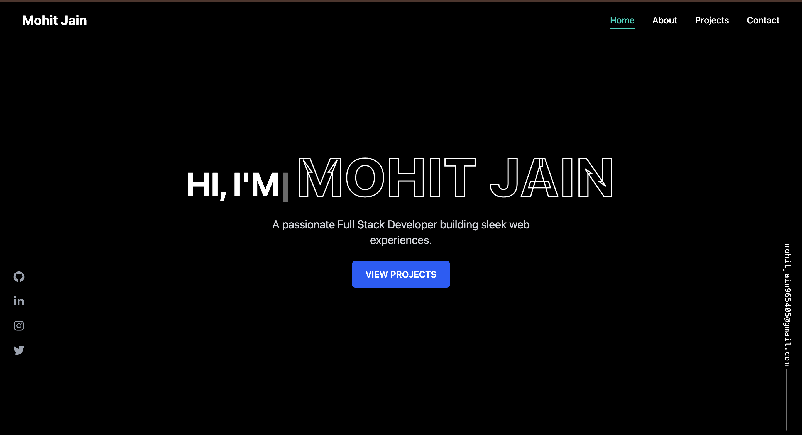
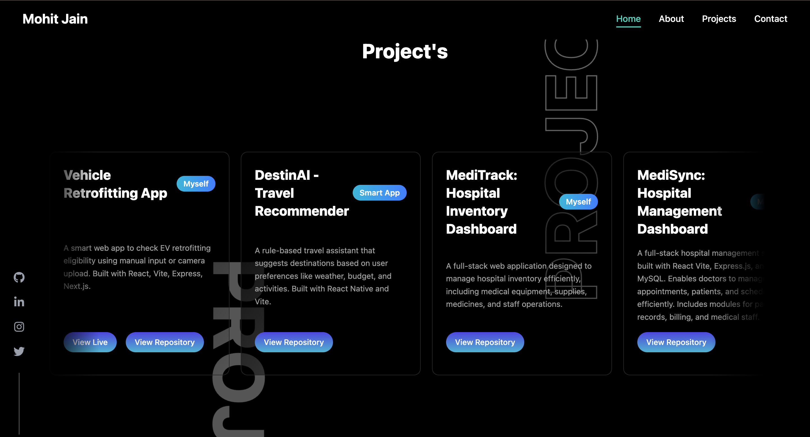
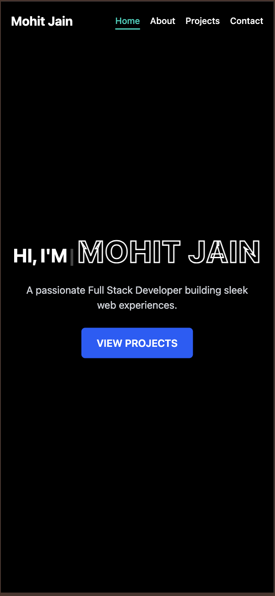

# Mohit Jain – Developer Portfolio 🚀

Welcome to my personal portfolio website! This project showcases my professional journey, technical skills, and featured projects, all built with modern web technologies.

📍 [Live Site →](https://mohitjain-portfolio.vercel.app)

---

## 🧑‍💻 About Me

I’m a Computer Science undergraduate passionate about building full-stack web applications and solving real-world problems with code. My interests lie in:

- Full-Stack Development (React.js, Node.js)
- Cloud Platforms (AWS, Azure, Firebase)
- AI/ML-enabled Apps
- Open Source Collaboration

---

## 🧱 Tech Stack

- **Frontend:** React.js, Vite, HTML, CSS, JavaScript
- **Animations & Styling:** Tailwind CSS, Framer Motion
- **Deployment:** Vercel
- **Tools:** Git, VS Code

---

## 📌 Features

- 💼 **Featured Projects Section** – Includes project cards with tech stacks and links to GitHub
- 🧠 **Skills Summary** – Shows tools, platforms, and languages I work with
- 📜 **Resume Access** – Downloadable resume from the site
- 🔗 **Social Links** – LinkedIn, GitHub, Email integration
- 💡 **Responsive Design** – Fully mobile-friendly and optimized layout

---

## 🖼️ Screenshots

> *(Add your actual screenshots in a `screenshots/` folder)*

### 💻 Landing Page


### 📂 Projects Showcase


### 📱 Mobile View


---

## 🚀 Running Locally

```bash
git clone https://github.com/Mohitjain9654/Mohit_Portfolio.git
cd Mohit_Portfolio
npm install
npm run dev
